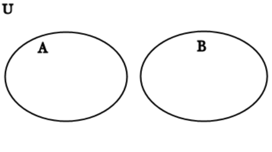
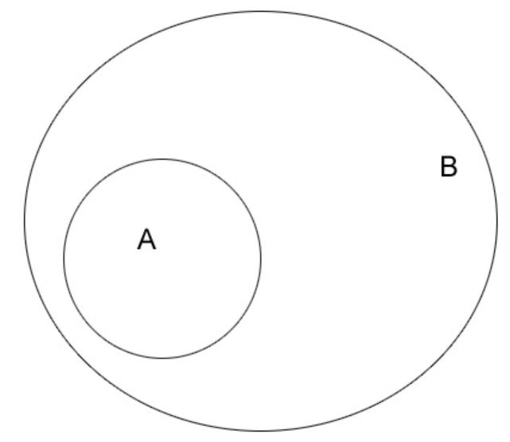
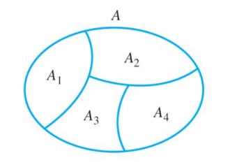
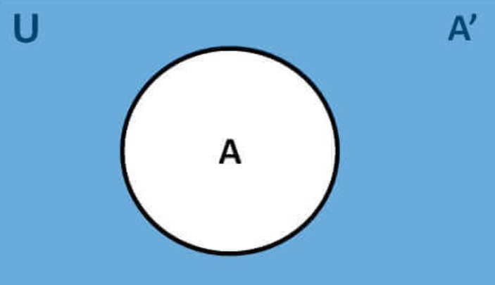

# Probability

> "How likely something is to happen"

> Num of possibilities that meet condition **Likelihood** / Num of equally likely possibilities **Sample Space**

**Theoretical** = Event / Sample Space

**Empirical** = Observed Outcome / Sample Space

**Law of Large Numbers**: _"Empirical probability will approach Theoretical probability as the number of Experiments Increases"_
## Set Theory

Intersection | Union | Disjoint | Subset | Partition | Compliment |
--- | --- | --- | --- | --- | ---
 |  |  |  |  | 

## Rules of Probability
1. For any event A, **0 ≤ P(A) ≤ 1** _(probability of an event can range from 0 to 1)_.
2. The sum of the probabilities of all possible outcomes always equals 1.
3. **P(not A) = 1 - P(A)** _(relationship between the probability of an event and its complement event. A complement event is one that includes all possible outcomes that aren't in A)_.
4. **_Addition Rule (disjoint events)_**: If A and B are disjoint events (mutually exclusive), then P(A or B) = P(A) + P(B).
5. **Addition Rule**: P(A or B) = P(A) + P(B) - P(A and B).
6. **_Multiplication Rule (independent events)_**: If A and B are two independent events, P(A and B) = P(A) * P(B).
7. The conditional probability of event B given event A is **P(B|A) = P(A and B) / P(A)**
8. **_Multiplication Rule_**: For any two events A and B, **P(A and B) = P(A) * P(B|A)**.

## Counting Methods
1. **Factorial Formula: n! = n * (n-1) * (n-2) * … * 2 * 1**. _(use when the number of items is equal to the number of places available, i.e. Find the total number of ways 5 people can sit in 5 empty = 5 * 4 * 3 * 2 * 1 = 120)_
2. **Fundamental Counting Principle**. Used when repetitions are allowed and the number of ways to fill an open place is not affected by previous fills  _(i.e. There are 3 types of breakfasts, 4 types of lunches, and 5 types of desserts. The total number of combinations = 5 * 4 * 3 = 60)_
3. **_Permutations: P(n,r) = n! / (n-r)!_**. Used when replacements are not allowed and order matters. _(i.e. A code has 4 digits in a particular order and the digits range from 0 to 9. How many permutations are there if one digit can only be used once = 10! / (10 - 4)! = 5,040)_
4. **_Combinations Formula: C(n,r) = n! / [ (n - r)! r! ]_**. Used when replacements are not allowed and order does not matter. _(i.e. To win the lottery, you must select the 5 correct numbers in any order from 1 to 52. What is the number of possible combinations. 52! / (52 - 5)!5!) = 2,598,960)_
